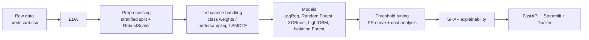

# NeedleScope: Credit Card Fraud Detection on Highly Imbalanced Data

> Finding the needle in the haystack: an end-to-end **machine learning fraud detection system** that handles **extreme class imbalance (0.17% fraud)** using SMOTE, class weighting, XGBoost and LightGBM, tunes the decision threshold with **PR-AUC and cost-based analysis**, explains predictions with **SHAP**, and serves them through **FastAPI**, **Streamlit** and **Docker**.


---

## Table of Contents
- [Overview](#overview)
- [The Problem: Why Accuracy Fails in Fraud Detection](#the-problem-why-accuracy-fails-in-fraud-detection)
- [Dataset](#dataset)
- [Approach](#approach)
- [Techniques Compared](#techniques-compared)
- [Results](#results)
- [Tech Stack](#tech-stack)
- [Project Structure](#project-structure)
- [Getting Started](#getting-started)
- [API Usage](#api-usage)
- [Roadmap](#roadmap)
- [Future Work](#future-work)
- [License](#license)
- [Author](#author)
- [Acknowledgements](#acknowledgements)

---

## Overview

**NeedleScope** is a complete, reproducible **credit card fraud detection** project built around one hard question: *how do you catch fraud when only about 1 in 600 transactions is fraudulent?*

The project walks through the full machine learning lifecycle:

- Exploratory data analysis of an **imbalanced classification** dataset
- Leakage-safe preprocessing (stratified split, scaling fitted on training data only)
- A systematic comparison of **imbalance handling techniques** (class weights, undersampling, oversampling, **SMOTE**)
- Gradient boosting models (**XGBoost**, **LightGBM**) plus an unsupervised **anomaly detection** baseline (Isolation Forest)
- **Decision threshold tuning** using Precision-Recall curves and a business cost model
- **Explainable AI** with SHAP, so every flagged transaction can be justified
- Deployment as a **FastAPI** prediction service with a **Streamlit** dashboard, packaged with **Docker**

The code is organised so that more fraud datasets can be added later without rewriting the pipeline.

## The Problem: Why Accuracy Fails in Fraud Detection

In a dataset where 99.83% of transactions are genuine, a model that predicts "genuine" every time scores **99.83% accuracy** while catching **zero fraud**. Accuracy is therefore the wrong metric.

This project evaluates models with the metrics that matter for imbalanced data:

- **Recall** (how much fraud is caught)
- **Precision** (how many alerts are real fraud)
- **F1-score**
- **PR-AUC** (area under the Precision-Recall curve), more informative than ROC-AUC when the positive class is rare
- **Cost-based threshold selection** (a missed fraud and a false alarm do not cost the same)

## Dataset

- **Source:** [Credit Card Fraud Detection (Kaggle, ULB Machine Learning Group)](https://www.kaggle.com/datasets/mlg-ulb/creditcardfraud)
- **Content:** transactions made by European cardholders over two days in September 2013
- **Size:** 284,807 transactions, of which 492 are fraud (about 0.172%)
- **Features:** `V1` to `V28` (PCA-transformed, anonymised), `Time`, `Amount`
- **Target:** `Class` (`1` = fraud, `0` = genuine)

The dataset is not included in this repository. Download `creditcard.csv` from Kaggle (check the dataset page for its license terms) and place it in `data/raw/`.

## Approach


```mermaid
flowchart LR
    A[Raw data<br/>creditcard.csv] --> B[EDA]
    B --> C[Preprocessing<br/>stratified split + RobustScaler]
    C --> D[Imbalance handling<br/>class weights / undersampling / SMOTE]
    D --> E[Models<br/>LogReg, Random Forest, XGBoost, LightGBM, Isolation Forest]
    E --> F[Threshold tuning<br/>PR curve + cost analysis]
    F --> G[SHAP explainability]
    G --> H[FastAPI + Streamlit + Docker]
```

**Leakage prevention rules used throughout the project:**

1. Stratified train/test split so both sets keep the same fraud ratio
2. Scalers are fitted on the training set only
3. SMOTE and other resampling are applied to training folds only, inside an `imblearn` pipeline
4. Model selection uses stratified k-fold cross-validation

## Techniques Compared

| Category | Techniques |
|---|---|
| Baselines | Logistic Regression, Random Forest (no imbalance handling) |
| Cost-sensitive learning | `class_weight='balanced'`, `scale_pos_weight` |
| Resampling | Random undersampling, random oversampling, SMOTE |
| Boosting | XGBoost, LightGBM |
| Unsupervised anomaly detection | Isolation Forest |
| Tuning | RandomizedSearchCV optimised for PR-AUC |
| Explainability | SHAP (global summary and single-transaction explanations) |

## Exploratory Data Analysis — Key Findings

- Dataset: 284,278 transactions after removing 529 exact duplicates (5 of which were fraud), 487 fraud (~0.17%) — confirms severe class imbalance
- No missing values anywhere in the dataset
- Features most correlated with `Class`: `V17`, `V14`, `V12`, `V3`, `V10`, `V16`, `V7`, `V11`, `V4` — these show the strongest early predictive signal
- `Amount` and `Time` have near-zero linear correlation with `Class`, though tree-based models may still pick up non-linear patterns
- V-features are largely uncorrelated with each other, as expected from their PCA origin

## Preprocessing

- Stratified 80/20 train/test split — train fraud ratio 0.1667%, test fraud ratio 0.1668% (near-identical, confirming stratification worked)
- `Time` and `Amount` scaled with `RobustScaler`, fit on the training set only and applied to the test set to avoid data leakage
- `V1`–`V28` left as-is, since they are already PCA outputs
- Fitted scaler and processed train/test splits saved to `models/scaler.joblib` and `data/processed/`

## Baseline Models — the "Accuracy Trap" Proven

Logistic Regression and Random Forest were trained with **no** imbalance handling to establish a reference point.

| Model | Accuracy | Precision | Recall | F1 |
|---|---|---|---|---|
| Logistic Regression (baseline) | 99.91% | 84.9% | 55.6% | 67.2% |
| Random Forest (baseline) | 99.96% | 95.7% | 78.2% | 86.0% |

Both models show near-perfect accuracy, but Recall tells the real story: Logistic Regression misses nearly half of all fraud, and Random Forest still misses about 1 in 5 (31 of 142 fraud cases in the test set). This gap is exactly what the imbalance-handling phase (class weighting, SMOTE) aims to close.

## Imbalance Handling — Complete

Five techniques were compared against Logistic Regression and Random Forest baselines: `class_weight="balanced"`, random undersampling, random oversampling, and SMOTE.

| Model | Precision | Recall | F1 |
|---|---|---|---|
| LogReg (baseline) | 84.9% | 55.6% | 67.2% |
| **Random Forest (baseline)** | **95.7%** | **78.2%** | **86.0%** |
| LogReg (class_weight=balanced) | 5.3% | 88.7% | 10.0% |
| Random Forest (class_weight=balanced) | 96.2% | 71.1% | 81.8% |
| LogReg (random undersampling) | 3.5% | 88.0% | 6.7% |
| Random Forest (random undersampling) | 5.0% | 88.0% | 9.5% |
| LogReg (random oversampling) | 5.3% | 88.7% | 10.0% |
| Random Forest (random oversampling) | 96.3% | 73.2% | 83.2% |
| LogReg (SMOTE) | 5.2% | 88.0% | 9.7% |
| Random Forest (SMOTE) | 91.4% | 74.6% | 82.2% |

**Key finding:** no imbalance-handling technique beat the untouched Random Forest baseline (F1 86.0%). Every resampling approach raised recall but at a steep precision cost — undersampling in particular collapsed Random Forest's precision to 5% by discarding almost all majority-class data. This happens because the dataset's top features (`V17`, `V14`, `V12`, etc.) already separate fraud from genuine transactions cleanly, so artificially rebalancing the training data confuses the model rather than helping it. Logistic Regression's oversampling result was numerically identical to its class-weighting result, since duplicating minority rows and reweighting the loss function have an equivalent effect on a linear model.

**Decision:** Random Forest (baseline) is the interim best model. The next steps — gradient boosting models (Notebook 05) and decision threshold tuning (Notebook 06) — are expected to be more productive than further resampling for this dataset.

## Gradient Boosting Models

From this point on, models are compared with **PR-AUC** (area under the Precision-Recall curve) alongside F1. F1 only measures a model at one fixed cutoff (0.5), while PR-AUC scores the model's ranking quality across every possible cutoff, so it is a fairer way to compare models whose probabilities sit on different scales.

| Model | Precision | Recall | F1 | PR-AUC |
|---|---|---|---|---|
| XGBoost (plain) | 96.2% | 71.1% | 81.8% | 0.825 |
| LightGBM (stabilised configuration) | 93.8% | 74.7% | 83.1% | 0.816 |
| XGBoost (`scale_pos_weight`) | 93.1% | 76.1% | 83.7% | 0.814 |
| Random Forest (baseline) | 95.7% | 78.2% | 86.0% | 0.803 |
| LightGBM (default settings) | 8.1% | 4.9% | 6.1% | 0.006 |
| LightGBM (default + `scale_pos_weight`) | 2.8% | 83.1% | 5.4% | 0.023 |

**Key findings:**

- **The four healthy models are effectively tied.** Their PR-AUC spans only 0.803–0.825, and the gap between the model that caught the most fraud (Random Forest, 111 of 142) and the one that caught the fewest (XGBoost plain, 101 of 142) is 10 cases. With only 142 fraud cases in the test set, a single train/test split cannot reliably rank them; cross-validation is planned to settle this.
- **F1 and PR-AUC disagree on the ranking.** Random Forest has the best F1 (at the default 0.5 cutoff) but the lowest PR-AUC, a reminder that a fixed cutoff can favour one model's probability scale over another's. Threshold tuning (Notebook 06) addresses this directly.
- **Default LightGBM diverged on this dataset.** Training loss oscillated instead of falling, raw model scores reached roughly ±10^5, and about 99.99% of predicted probabilities saturated to exactly 0 or 1, leaving the model at near-chance PR-AUC (0.006–0.023). A more conservative configuration (lower learning rate, fewer leaves, L2 regularisation and a cap on leaf output) trained stably and reached PR-AUC 0.816. Several settings were changed together, so which one was responsible was not isolated.
- **`scale_pos_weight` had a mild effect on XGBoost** (recall +5 points, precision −3 points), far gentler than the precision collapse seen with Logistic Regression in the imbalance-handling comparison.

## Results

> Results will be added here after the evaluation notebook is completed. This section will contain the final model comparison table, the Precision-Recall curves and the cost-based threshold analysis.

| Model | Imbalance strategy | Precision | Recall | F1 | PR-AUC |
|---|---|---|---|---|---|
| _to be added_ | | | | | |

## Tech Stack

- **Language:** Python
- **Data and ML:** pandas, NumPy, scikit-learn, imbalanced-learn, XGBoost, LightGBM
- **Visualisation:** Matplotlib, Seaborn
- **Explainability:** SHAP
- **Serving:** FastAPI, Streamlit
- **Packaging:** Docker
- **Tooling:** Jupyter, Git, GitHub

## Project Structure

```
needlescope-fraud-detection/
├── data/
│   ├── raw/                 # creditcard.csv (not tracked by git)
│   └── processed/           # train/test splits
├── notebooks/               # 01_eda ... 07_shap_explainability
├── src/                     # config, data loading, preprocessing, training, evaluation, prediction
├── models/                  # saved model pipeline (.joblib)
├── reports/
│   └── figures/             # plots used in this README
├── api/                     # FastAPI service
├── app/                     # Streamlit dashboard
├── Dockerfile
├── requirements.txt
└── README.md
```

## Getting Started

**1. Clone the repository**
```bash
git clone https://github.com/raheel-9deem/needlescope-fraud-detection.git
cd needlescope-fraud-detection
```

**2. Create and activate a virtual environment**
```bash
python -m venv venv

# Windows (PowerShell)
venv\Scripts\activate

# macOS / Linux
source venv/bin/activate
```

**3. Install dependencies**
```bash
pip install -r requirements.txt
```

**4. Add the dataset**

Download `creditcard.csv` from [Kaggle](https://www.kaggle.com/datasets/mlg-ulb/creditcardfraud) and place it at:
```
data/raw/creditcard.csv
```

**5. Run the notebooks**
```bash
jupyter notebook
```
Open the notebooks in `notebooks/` in order (`01` to `07`).

**6. Run the API** _(available after the deployment phase)_
```bash
uvicorn api.main:app --reload
```
Interactive docs: `http://127.0.0.1:8000/docs`

**7. Run the dashboard** _(available after the deployment phase)_
```bash
streamlit run app/streamlit_app.py
```

**8. Run with Docker** _(available after the deployment phase)_
```bash
docker build -t needlescope .
docker run -p 8000:8000 needlescope
```

## API Usage

_Planned interface, to be finalised during the API phase._

| Method | Endpoint | Description |
|---|---|---|
| `GET` | `/health` | Service health check |
| `POST` | `/predict` | Returns fraud probability and the final decision for one transaction |

Example response shape:
```json
{
  "fraud_probability": 0.93,
  "is_fraud": true,
  "threshold": 0.42
}
```
The request body takes the 30 model features: `Time`, `V1` to `V28`, and `Amount`.

## Roadmap

- [x] Project setup and environment
- [x] Exploratory data analysis
- [x] Preprocessing and leakage-safe splitting
- [x] Baseline models and the accuracy trap
- [x] Imbalance handling comparison (class weights, undersampling, oversampling, SMOTE)
- [x] Gradient boosting models (XGBoost, LightGBM) evaluated with PR-AUC
- [ ] Isolation Forest, cross-validation and hyperparameter tuning
- [ ] Threshold tuning and cost-based analysis
- [ ] SHAP explainability
- [ ] Refactor notebooks into a reusable `src/` package
- [ ] FastAPI prediction service
- [ ] Streamlit dashboard
- [ ] Docker packaging
- [ ] Final results and documentation

## Future Work

- Support additional fraud datasets (PaySim, IEEE-CIS) through dataset adapters and a config-driven pipeline
- Time-based validation to simulate real-world deployment
- Autoencoder-based anomaly detection
- Data drift monitoring
- Experiment tracking with MLflow
- React-based analytics dashboard

## License

This project is released under the [MIT License](LICENSE).

## Author

**Raheel Nadeem**

- LinkedIn: [linkedin.com/in/raheel-nadeem](https://www.linkedin.com/in/raheel-nadeem)
- Instagram: [@iraheel_nadeem](https://www.instagram.com/iraheel_nadeem)
- Website: [raheelnadeem.online](https://raheelnadeem.online)
- GitHub: [@raheel-9deem](https://github.com/raheel-9deem)

If this project helps you, consider giving it a star.

## Acknowledgements

- Dataset provided by the [ULB Machine Learning Group](https://mlg.ulb.ac.be) in collaboration with Worldline, made available on Kaggle.
- Dal Pozzolo, A., Caelen, O., Johnson, R. A., and Bontempi, G. *Calibrating Probability with Undersampling for Unbalanced Classification.* IEEE CIDM, 2015.
- Libraries: scikit-learn, imbalanced-learn, XGBoost, LightGBM, SHAP, FastAPI, Streamlit.
